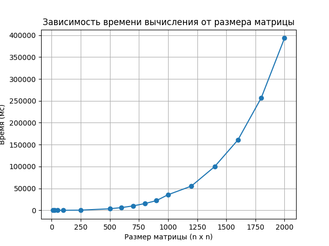

# Лабораторая №1

## Задание: 
1. Написать программу на языке C/C++ для перемножения двух матриц.

## Характеристики ЭВМ
1. CPU - Intel(R) Core(TM) i3-8100 CPU 3.60 GHz
2. ОЗУ - 16 ГБ
3. GPU - AMD Radeon RX 5700 XT
4. Windows 10 Home

### График 

## Выводы
При последовательном выполнении задания, время увеличивается с экспоненциальным законом от количества элементов
